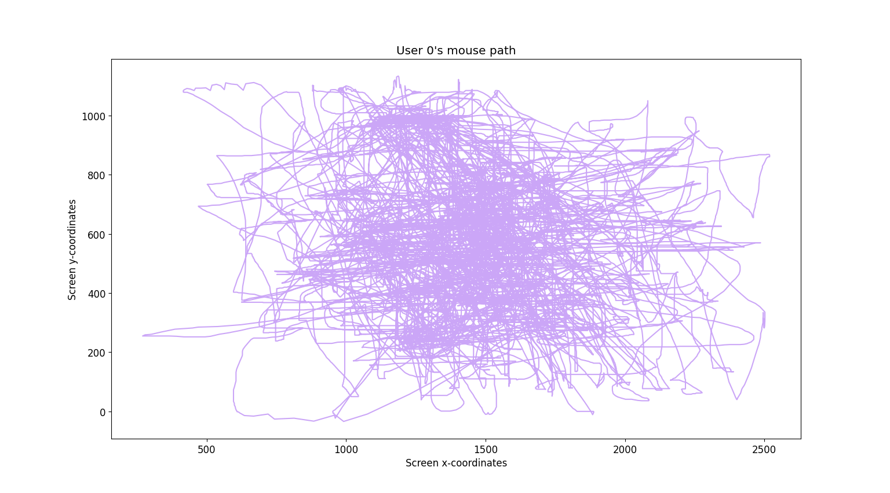

# :mouse: mAuth Mouse Machine Learning
*TODO:* Link conference/journal paper

This project involves the development of a proof of concept model using 
computer mouse data that could potentially be used in an authentication 
scheme. The model uses KNN, SVM, and decision tree algorithms to analyze 
data such as mouse position, time of the event, and button press duration. 
The goal is to determine if this data can be used to accurately identify a 
user and differentiate them from potential imposters. By exploring the 
potential of mouse data for authentication purposes, this project aims 
to contribute to the growing field of biometric authentication research.

# :floppy_disk: Data collection
- The **raw** dataset is located in the [./raw_data/](./raw_data) folder
  - The same subjects with their extracted features are in the [./synth_data/extracted_features_data/](./synth_data/extracted_features_data) folder
- A file with all subject data can be found at [./synth_data/user_all_data.csv](./synth_data/user_all_data.csv).*
  - Similarly, a file with all of the subjects' extracted features will be in [./synth_data/user_all_feature_data.csv](./synth_data/user_all_feature_data.csv)

Data collection is done within [collection.py](./collection.py), which utilizes the 
[pynput](https://pypi.org/project/pynput/) library to collect mouse input data. Specifically, 
we collected the UNIX timestamp of the event, X and Y positions of the event, which button was pressed, 
and how long it was pressed for.

## :mag: The Data
Here is a sample piece of data:

| ID  | Timestamp          | X    | Y   | Button | Duration             |
|-----|--------------------|------|-----|--------|----------------------|
| 2   | 1676925152.344601  | 901  | 488 | -1     | -1                   |
| 2   | 1676925152.3605819 | 915  | 482 | -1     | -1                   |
| 2   | 1676925157.8644285 | 975  | 301 | -1     | -1                   |
| 2   | 1676925158.0728395 | 975  | 301 | 1      | -1                   |
| 2   | 1676925158.1127932 | 975  | 301 | 1      | 0.03995370864868164  |
| 2   | 1676925152.368573  | 924  | 480 | -1     | -1                   |
| ... | ...                | ...  | ... | ...    | ...                  |

- **ID:** Subject ID
- **Timestamp:** UNIX Timestamp of the event
- **X, Y**: The X and Y positions of the event, where it happened on the screen
- **Button**: The button that was pressed, for this, we used the following mapping:
  - 0: Left click
  - 1: Right Click
  - 2: Middle Click
  - 3: Scrolling Down
  - 4: Scrolling Up
  - 5: Button X1 *(rarely used)*
  - 6: Button X2 *(rarely used)*
- **Duration**: The duration of the event, only used to track how long a button press event was

Button X1 and X2 were the forward/backwards buttons on mice. This wasn't useful for the game during data collection,
so will likely be cleaned out/not useful.

## :eyes: Visualization

To visualize the data, we created [a plotting script](./plot.py) to view the mouse locations.

## :family: The Team
- Team Lead - [Braxton Fair](https://github.com/taxborn)
- Game Analysis and Evaluation Lead - [Mahlet Asmare](https://github.com/mahletzelalem)
- Model and Technical Paper Lead - [Cole Harp](https://github.com/Cole-Harp) and [Mohammed Ahnaf Khalil](https://github.com/KhalilAhnaf)